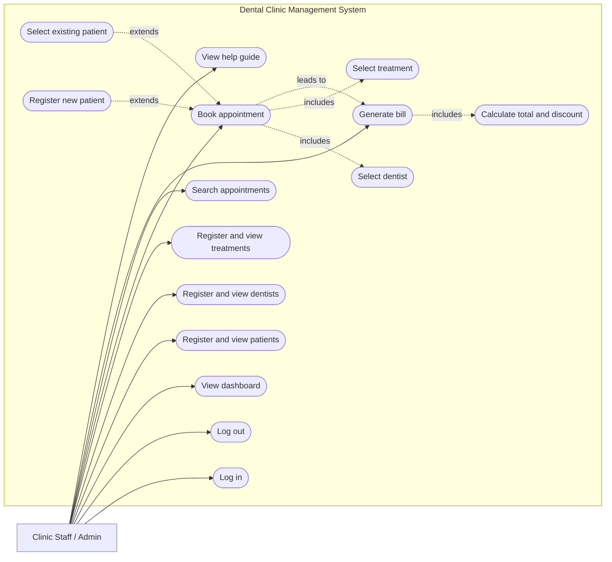
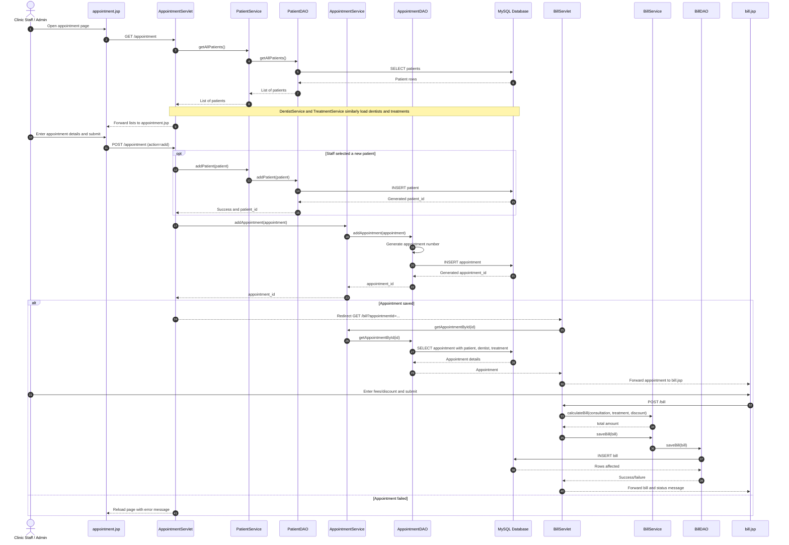
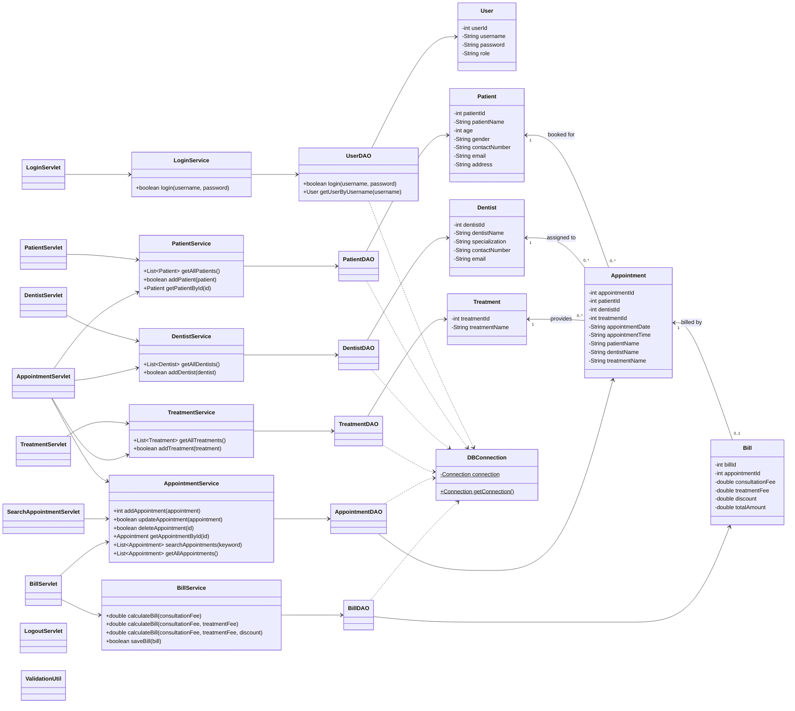

# Dental Clinic Management System — UML Diagrams

These diagrams are derived from the Java models, JSP pages, servlets, services,
DAOs, and `schema.sql` in this repository. GitHub and many Markdown editors can
render the Mermaid blocks directly.

## 1. Use-case diagram

The application exposes a single authenticated staff interface. The database
contains an `admin` role, so the primary actor is shown as clinic staff/admin.
Patients and dentists are managed records rather than direct system users.

## 2. Sequence diagram — book an appointment and generate its bill

This is the main end-to-end workflow implemented by `AppointmentServlet` and
`BillServlet`. The optional block represents choosing **New patient** in the
appointment form.

## 3. Class diagram

The diagram shows the domain entities and the implemented Servlet–Service–DAO
layers. Routine getters/setters and servlet lifecycle methods are omitted to
keep it readable.

## Implementation notes discovered during analysis

- `AppointmentDAO` expects an `appointments.appointment_number` column, but it
  is absent from `schema.sql`.
- `BillDAO` inserts `consultation_fee`, `treatment_fee`, and `total_amount`, while
  `schema.sql` defines `patient_id`, `amount`, `bill_date`, and `status` instead.
- The `Bill` model contains `discount`, but `BillDAO` does not persist it.
- Appointment update/delete operations exist in the service and DAO layers, but
  the current `AppointmentServlet` only exposes appointment creation.
- `AppointmentAPI.java` is empty, so no external web-service actor is included.

